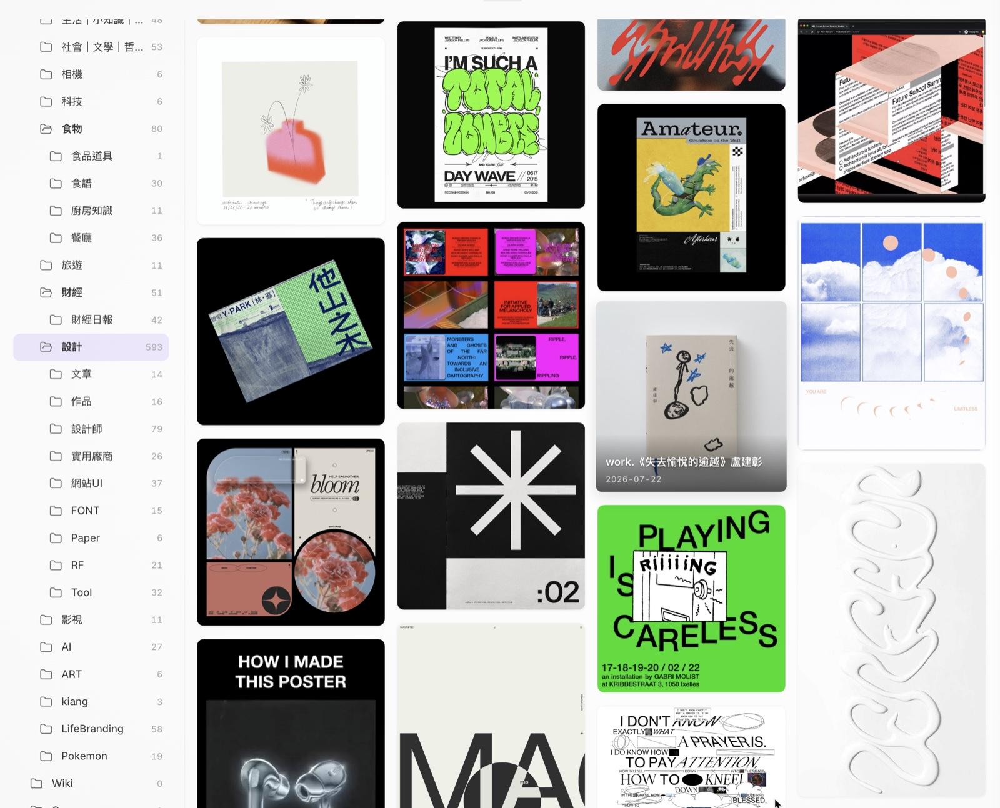

# Gallery Navigator

A visual way to browse your Obsidian vault: a folder/tag tree on the left, a Pinterest-style **cover-image card wall** on the right. Designed as a visual alternative to list-based file explorers.

Interface available in **English** and **繁體中文** (follows your Obsidian language setting, with a manual override in settings).

## Screenshots



| Card wall | Tag tree | Search |
|---|---|---|
|  |  |  |

## Features

### Card wall
- True JS masonry layout with lazy, chunked rendering (handles folders with thousands of files, mobile-friendly)
- Covers from `cover:` frontmatter, first embedded image, image files themselves, PDF first pages, and web page `og:image` for link notes
- Three image-card layouts, switchable from the toolbar's **⋯ More** panel:
  - **Photo** — title overlaid on the image, so the wall reads as a sheet of photographs
  - **Museum** — image on top, caption below, like a label beside an exhibit
  - **Editor** — small thumbnail with a large date block and a text excerpt, for text-first browsing
- Pin cards to top, per-card background colors, multi-select with batch move / delete (optionally removing orphaned attachments) / copy-wiki-links
- Canvas and Base files render as cards too (Canvas uses its first embedded image as the cover when available)

### Navigation
- Folder tree with drag-to-reorder, custom colors, hide/unhide, favorites, and inline rename
- Bear-style nested tag tree with an "untagged" node
- Follow mode: opening a note reveals it in the tree and card wall
- Mobile: side-by-side panes with finger-following swipe navigation

### Full-text search
- Built-in BM25 index over all notes **and PDFs** (Chinese word segmentation + bigram fallback)
- Spotlight-style popup search (assignable hotkey) with thumbnails, highlighted matches, and context snippets
- `Shift+Enter` sends all results to the card wall
- PDF text is read from the [Text Extractor](https://github.com/scambier/obsidian-text-extractor) plugin's cache when available (optional dependency — file-name search works without it)

### Extras (can be disabled individually)
- **Image peek**: Quick Look-style image preview with share/copy actions
- **Link cards**: bare URLs rendered as rich preview cards
- **Clean links**: strips tracking parameters (`utm_*`, `xmt`, `slof`, `fbclid`, `igsh`, `gclid`…) from URLs — automatically on paste, from the editor right-click menu (one link, the selection, or the whole note), or by right-clicking a link card. Blacklist-based, so functional parameters like YouTube's `?v=` are never touched; extra/keep lists are configurable. Parameter stripping is entirely offline. Threads/Instagram `/share/` links hide their tracking code in the path instead, so expanding those to the real post URL is an opt-out network request (see below).

## Network use disclosure

This plugin makes network requests only for the features below. Nothing is collected, tracked, or sent anywhere else; there is no telemetry.

| Feature | What is sent | To where |
|---|---|---|
| Link previews / link cards | GET requests for URLs found in your notes, to read `og:image`/metadata | The sites your notes link to |
| Site icons on link cards | The domain name of each linked site | Google favicon service (`www.google.com/s2/favicons`) |
| Link cards for Threads / Instagram posts | The post URL being previewed, to read the author name and post text | Meta's oEmbed endpoints (`instagram.com`, `threads.net`) |
| Clean links — short link expansion (on by default, can be turned off) | A GET request for the `threads.com/share/…` or `instagram.com/share/…` link being expanded, to read its `canonical` URL | Threads / Instagram |

**About User-Agent headers.** Metadata requests are sent with the User-Agent of a common browser or of a link-preview bot (`facebookexternalhit`, `Slackbot-LinkExpanding`), trying them in that order until one returns usable metadata. Some sites return `403` to a default User-Agent but serve `og:` tags to link-preview bots, so without this most cards would come back empty. This is the same mechanism chat apps such as Slack and iMessage use to render link previews, and only public metadata is read — no login, no credentials, no user data.

All caches (link previews, PDF thumbnails) are stored locally in the plugin folder.

## Install

Until this plugin is available in the community store, install manually:

1. Download `main.js`, `manifest.json`, and `styles.css` from the latest [release](https://github.com/groundfic/obsidian-gallery-navigator/releases)
2. Copy them into `<your vault>/.obsidian/plugins/gallery-navigator/`
3. Enable **Gallery Navigator** in Settings → Community plugins

Or use [BRAT](https://github.com/TfTHacker/obsidian42-brat) with this repository.

> [!IMPORTANT]
> **Coming from Image Peek or Link Card Preview?** Disable them first.
>
> Both of my earlier standalone plugins are now built into Gallery Navigator as the **Image peek** and **Link cards** modules. Running either one alongside this plugin means the same work happens twice: two sets of document listeners, two cards rendered for the same URL, and two separate caches for the same downloads.
>
> Their settings and caches are **not** carried over — link previews will simply be fetched again on first use. If you prefer, you can keep using the standalone versions and turn the matching module off here (Settings → Gallery Navigator → *Image peek* / *Link cards*).

## Development

```bash
npm install
npm run dev        # build CSS once, then esbuild watch for JS
npm run dev:css    # watch the CSS parts only (handy while styling)
npm run build      # production bundle → main.js + styles.css
```

Source lives in `src/`. **Both `main.js` and `styles.css` in the plugin root are build artifacts — don't edit them directly.**

- **JS** — `src/main.js` is the entry point, bundled by esbuild.
- **CSS** — Obsidian only loads a single `styles.css`, but 3000 lines in one file is unmaintainable, so it is assembled from parts by `scripts/build-css.mjs`:

  | Part | Scope |
  |---|---|
  | `src/header.css` | File header comment |
  | `src/gallery.css` | `.gn-*` — tree, card wall, toolbar |
  | `src/peek.css` | `.qp-*` — image peek |
  | `src/linkcard.css` | `.lcp-*` — link cards |

  Order matters (later parts can override earlier ones). The build refuses to write `styles.css` if braces are unbalanced, so a truncated part fails loudly instead of silently breaking the stylesheet.

- **UI strings** — `src/i18n.js`, English text as keys, with a zh-TW dictionary.

## License

[MIT](LICENSE)
